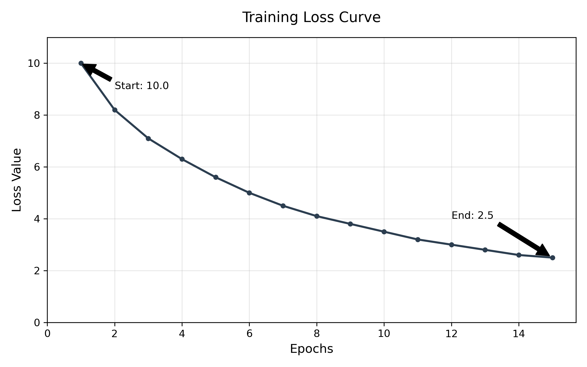

    

This project presents a complete implementation of a language model built entirely from scratch, designed specifically for the mixed-language communication style used across East Africa commonly referred to as KiswaEnglish. This form of speech naturally blends Kiswahili and English in daily conversation, a pattern rarely supported well by standard global language models.

Unlike most existing solutions, this model was developed without relying on pre-trained model weights. It combines **custom synthetic data**, **publicly available Swahili corpora**, and **crawled real-world content** to reflect local language use, culture, and context. The entire system is optimized to run efficiently on standard consumer hardware, making it accessible to students, developers, and researchers without access to specialized infrastructure.

#  Key Features

- Built completely from scratch, no external model dependencies
- Native support for pure Kiswahili, pure English, and natural mixed-language text
- Balanced training data: **30% synthetic / 70% real data** for best quality and consistency
- Real data sourced from trusted public corpora and reliable local & regional websites
- Lightweight architecture optimized for laptops and personal devices
- Capable of conversation, instruction following, explanation, and basic reasoning
- Fully independent, customizable, and easy to extend

# Getting the Data

All data is openly available or can be generated locally:

- **Original Swahili Corpus**: Download from **Mendeley Data** → https://data.mendeley.com/research-data/?query=swahili
- **Crawled data**: Generated automatically by running `python crawl_data.py`
- **Synthetic data**: Created directly using the project’s scripts
- **Final dataset**: Built using `python build_full_dataset.py` following the 30/70 ratio

*Note: Data folders are excluded from Git to keep the repository lightweight — you can generate or download them yourself whenever needed.*

---

# Technical Details

| Attribute | Value |
|-----------|-------|
| **Model Size** | Approximately 120 million parameters |
| **Architecture** | Custom Transformer-based design with 12 layers and 8 attention heads |
| **Context Window** | 2048 tokens |
| **Tokenizer** | Custom-built using SentencePiece, trained on full dataset (3,500 vocabulary size) |
| **Training Data** | Mixed set: synthetic + original corpus + crawled content (~100–110 million tokens total) |
| **Data Split** | 30% synthetic / 70% real data |
| **Hardware Used** | MacBook M3 with 8GB unified memory |
| **Framework** | MLX for efficient performance on Apple hardware |
| **Training Progress** | Loss reduced from above 10.0 to ~2.5 over 15+ epochs |

---

# Project Structure

All components were developed specifically for this work:

- **`synthesize_all.py`** → Generates structured synthetic text in Swahili, English, and KiswaEnglish
- **`crawl_data.py`** → Safely collects clean text from 10 Swahili and 10 English public sources, saved to `./Crawled_Data`
- **`build_full_dataset.py`** → Combines all sources into one balanced dataset following the 30/70 rule
- **`build_tokenizer.py`** → Trains custom tokenizer to handle mixed language patterns correctly
- **Neural network definition** → Lightweight design balanced for performance and memory use
- **Training pipeline** → Optimized for stable learning on consumer hardware
- **Inference engine** → Generates responses efficiently in all supported language forms

---

# How to Contribute

Contributions are welcome and easy to follow:

- **Code, ideas, documentation, and new data sources**  submit via Pull Requests or open an Issue
- **Do NOT commit large data files or model weights**  these are too big for version control
- **To run locally**: Install dependencies, download or generate data, and build the dataset using the scripts provided
- **To share new data**: Upload to a public hosting service and share the link instead of pushing files directly

## Results

The model successfully produces natural, grammatically correct text in all supported modes:

- **Pure Kiswahili**: Clear explanations, advice, and conversation
- **Pure English**: Accurate answers and structured content
- **KiswaEnglish**: Natural code-switching matching how people actually speak

Training was stable and effective, confirming that high-quality language models can be built independently using widely available resources.

## Use Cases

- Offline AI assistant for education and daily use
- Localized customer service tools
- Educational content generation aligned with regional languages
- Research platform for language modeling and low-resource language technology
- Foundation for further development of African language AI

---

## Future Work

- Expand vocabulary to include regional dialects, slang, and more specialized terms
- Scale model size and capacity as hardware allows
- Add features such as translation, summarization, and document understanding
- Build a simple web interface to allow public use and collect feedback
- Optimize deployment for mobile and web platforms
- Share methodology to support development for other African languages

 

    

## License

This project is open for research, education, and non-commercial use.

    
    
    

